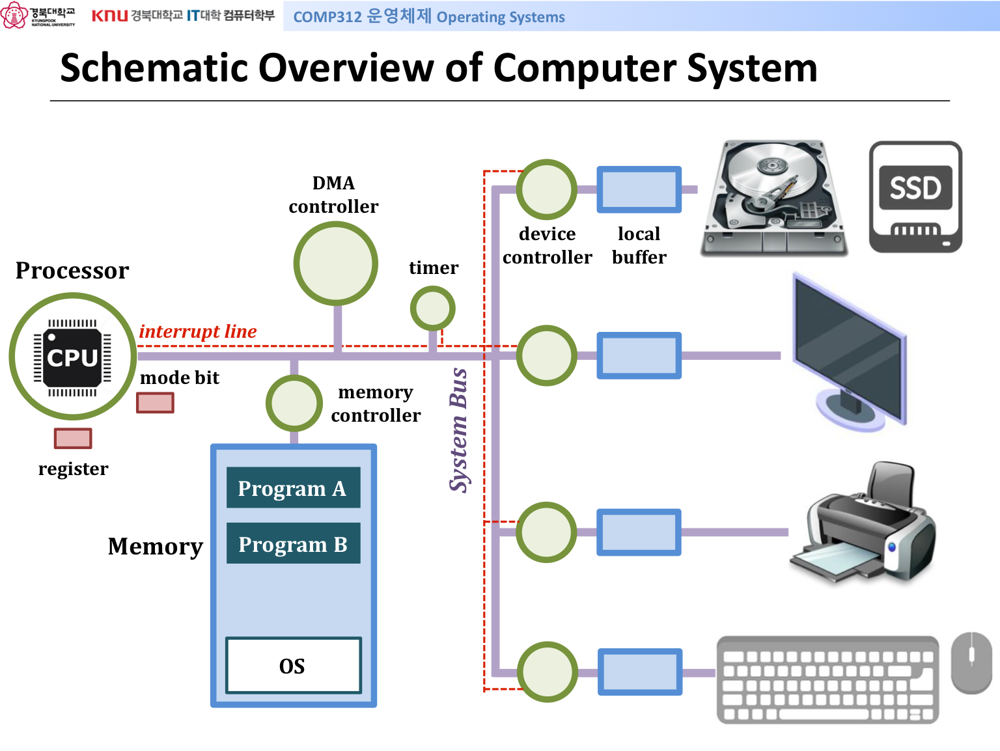
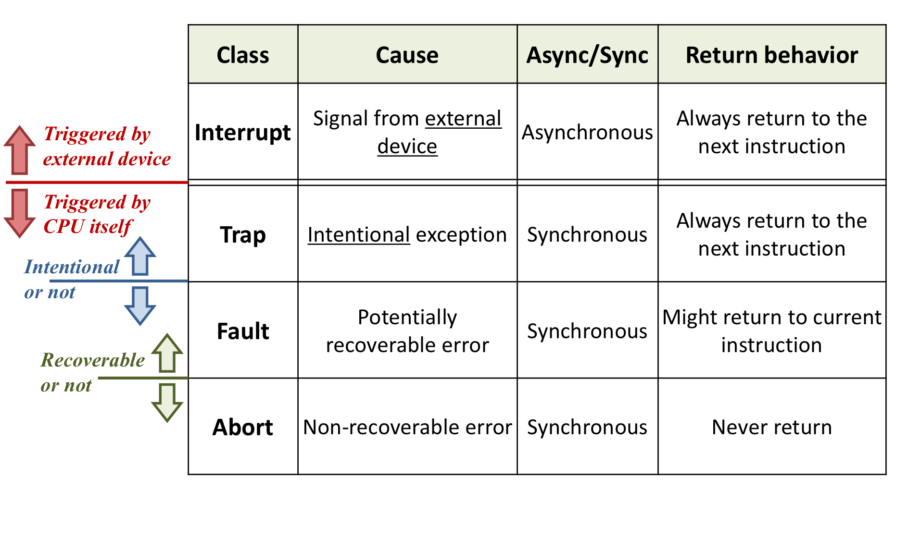
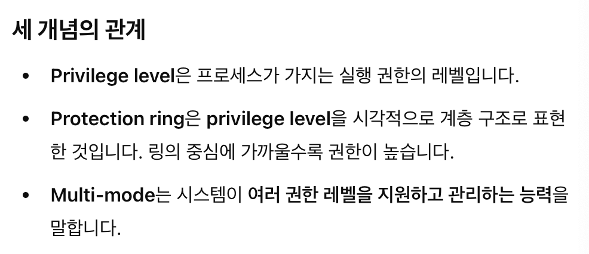

# Computer System

topic / important / question

## Remind

- Von Neumann Machine
    - Stored-program computer
        - [a computer that stores instructions in its memory to enable it to perform a variety of tasks in sequence or intermittently.](https://www.britannica.com/technology/stored-program-concept)
    - A processing unit / A control unit / Memory / External mass storage / I/O device
    - Von Neumann bottleneck
        - [the system slowdown due to the seperation of the CPU and Main Memory.](https://web.archive.org/web/20131212205159/http://aws.linnbenton.edu/cs271c/markgrj/)

## Basics of ISA

- architecture = conceptual structure(state) and functional behavior(operation)
    - register+memory(State) / instruction(Opertaions)
        - Stateless element(combinational logic) : dependent only on its **present input signal**
        - State element(sequential logic) : dependent both the **current inputs & the past history of inputs** / [출처](https://en.wikipedia.org/wiki/State_(computer_science))
    - What is Word?
        - [the natural unit of data used by a particular processor design.](https://en.wikipedia.org/wiki/Word_(computer_architecture)) = **different depending on the system**(ISA)
- **What does it mean to have CPU privileges? / CPU의 권한을 갖는다의 의미**
    - **A process runs at a specific privilege level. / process가 특정 권한 수준에서 동작**
    - [Privilege Level](https://www.sciencedirect.com/topics/computer-science/privilege-level): Kernel mode(0), User mode(3)
        - → ARM에서는 모드 가 7단계 이면 mode bit이 2bit이 아닌가
            - →[5bit임](https://developer.arm.com/documentation/ddi0406/b/System-Level-Architecture/The-System-Level-Programmers--Model/ARM-processor-modes-and-core-registers/ARM-processor-modes?lang=en)

## Computer System

### 1. Mode Bit

- Dual mode(or multi-mode) in OS by setting “mode bit”
    - Mode bit is a flag in hardware
    - Mode bit 0 → kernel mode → OS gains control of the processor
    - Mode bit 1 → user mode → user application is running
    - **Why are dual mode (or multi-mode) needed?**
        - [protect data and functionality from faults and malicious behavior](https://en.wikipedia.org/wiki/Protection_ring)
        - Protect OS itself and other system components from incorrect or illegal program execution

### 2. Timer

- main task: **interrupt the CPU after a specific period of time**(→ It is determined by hardware design)
- When counter reaches “zero” → interrupt(**timer interrupt**) occurs & control is transferred back to the OS
- **use implement time-sharing system**

### 3. I/O Device

- I/O device controller
    - **Hardware unit** which provides a hardware interface between the computer and the I/O devices
    - Another type of small CPU → has control register, status register
    - Finishing I/O processing → sends an interrupt signal to the CPU
- **Device driver**
    - **Computer program** the operates or controls a particular type of device that is attached to a computer
    - Another type of small OS for I/O devices

### 3. Exception

- **definition : 예외적인 상황 → user code 내에서 수행할 수 없는 상황이 발생했을 때 발생하는 process까지가 exception**
- what is different exception and interrupt? → exception > interrupt이다. 적어도 이 책에선
- **Asynchronous Exceptions: Interrupt**
    - Caused by events external to the processor(e.g. timer, I/O devices)
    - **Unpredictable**
    - Handler **returns to next instruction**
    - example
        - Timer interrupt
        - I/O interrupt from external device(e.g. Ctrl-C)
- **Synchronous Exceptions**
    - Caused by events that occur as a result of executing an instruction, and triggered by the CPU itself
    - software interrupt or internal interrupt
    - **Traps / scanf를 요청은 Traps scanf에서 처리된 값이 오는건 Interrupt**
        - **Intentional**
        - examples → system calls
        - **return to next instruction**
    - **Faults**
        - **Unintentional but possibly recoverable**
        - examples → page faults / 모든 상황이 동일하다는 전제에서 synchronous
        - **return to current instruction or aborts**
    - **Aborts**
        - **Unintentional and unrecoverable**
        - examples → illegal instruction
        - **aborts**

### Questions(김준형):

1. Aborted된 Faults의 경우 Abort와 어떻게 구분?
2. Architecture 마다 mode 종류가 상이한데 그럼에도 mode bit은 0과 1로 동일한가?

### Resolution/Answer:

1. {질문에 대한 최종 답변 또는 해결 방안}

### References:

1. {참고하면 좋을 내용}

---

### Questions(윤정훈):

1. {이 질문이 나온 배경이나 관련된 개념을 간단히 설명}
2. scanf가 일어나는 건 Trap → Interrupt로 exeception이 2번 발생인가?

### Resolution/Answer:

1. {질문에 대한 최종 답변 또는 해결 방안}

### References:

1. {참고하면 좋을 내용}

---

### Questions(조재용):

1. [**What is the difference between Operating system processing modes and CPU processing modes?**](https://stackoverflow.com/questions/5128130/what-is-the-difference-between-operating-system-processing-modes-and-cpu-process)
2. [**Are "Protection rings" and "CPU modes" the same thing?**](https://stackoverflow.com/questions/59812595/are-protection-rings-and-cpu-modes-the-same-thing)
3. protection ring, cpu modes, privilege level의 관계는 무엇인가?
4. Timer interrupt는 predictable아닌가? 왜 Interrupt인가?
5. scanf로 trap발생 → cpu가 다른걸 돌아다니다가 입력받으면 interrupt 발생해서 입력받은거 처리함

### Resolution/Answer:

1. {질문에 대한 최종 답변 또는 해결 방안}
2. 
3. 

### References:

1. {참고하면 좋을 내용}
