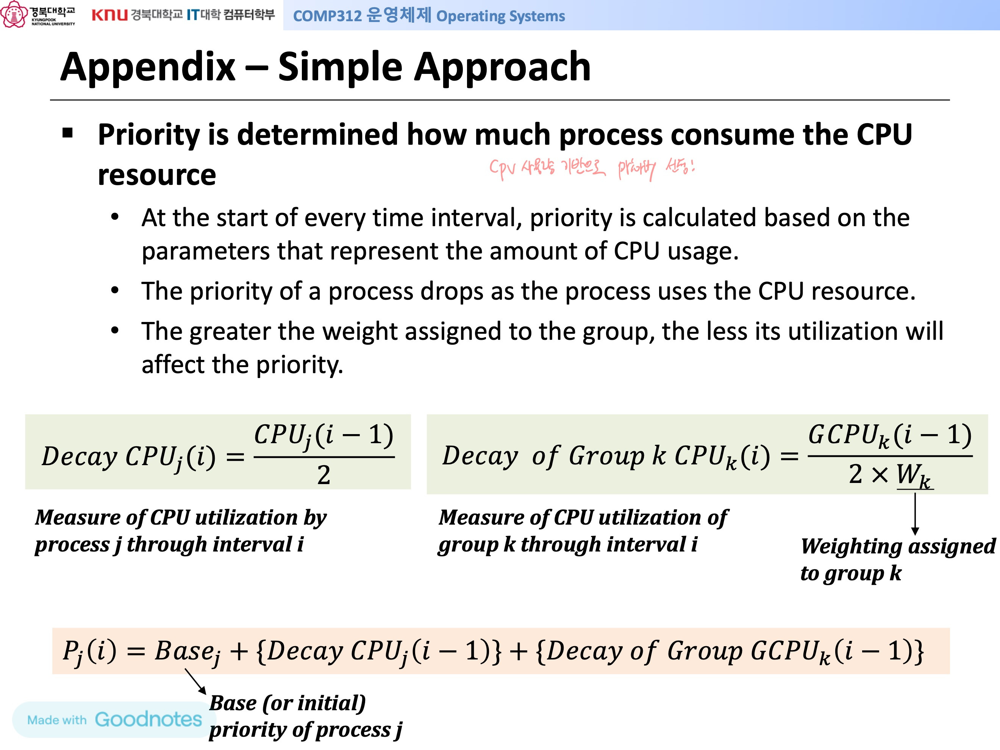
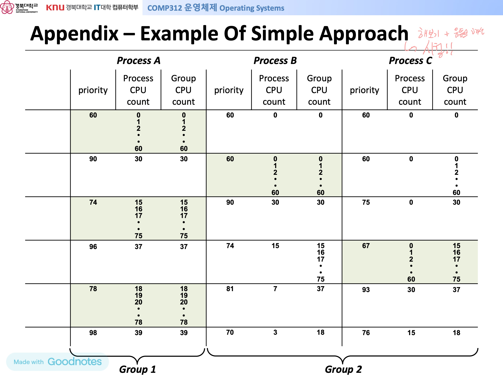
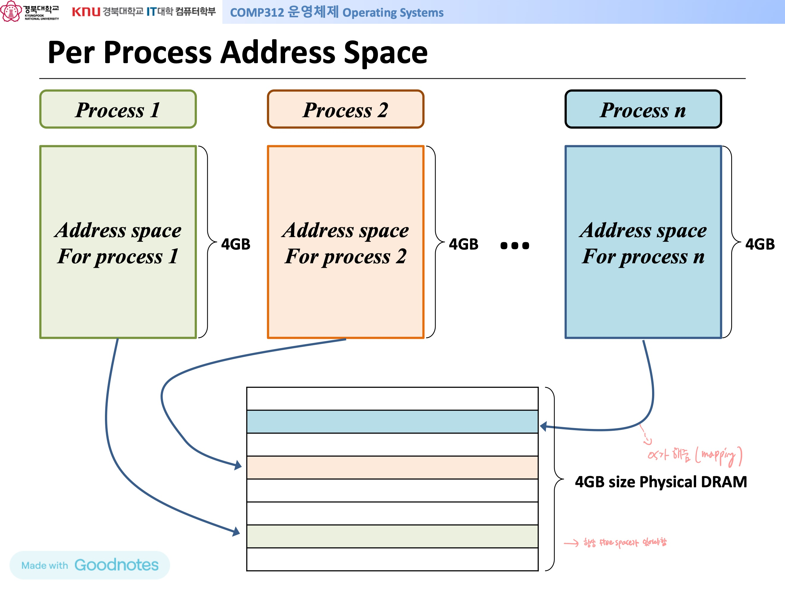
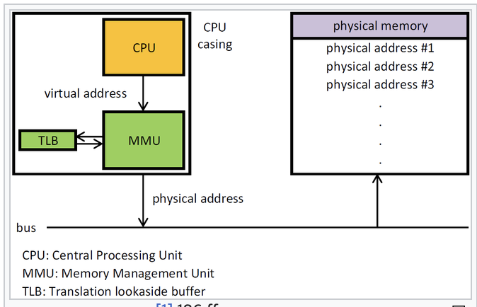

# Proportional-share Scheduling

- Lottery scheduling
- Stride scheduling

## Stride Scheduling

cpu 사용량을 기반으로 각 process의 보폭만큼 cpu 사용 권한을 가짐
(cpu 사용량 = pass, 보폭 = stride)

Pick the process to run that has the lowest pass value 
→ 이 방법으로 next process를 선정하고, pass value가 같은 경우 randomly chosen,
→ ~~모든 Process의 Pass value가 동일해질 때까지~~ repeat!!

<aside>

### Pass란?

virtual time index to track each process’s global progress
즉, 현재까지 cpu를 얼만큼 사용했는지를 누적 보폭을 합한 값

### Stride란?

Inversely proportional to tickets and represents the interval between selections
= A large number / the number of tickets of the process
각 process마다 할당된 ticket 수로 large number를 나눈 값

</aside>

### Strengths of Stride Scheduling

1. Strong deterministic guarantees
→ Lottery Scheduling의 단점이었던 probabilistic guarantees를 보완
2. Good short-term accuracy
→ short-term에도 ticket의 수가 process 실행 순서에 정확하게 반영됨
3. Low response time variability
→ 각 process가 최소 1번씩 실행되는데까지 걸리는 시간이 서로 크게 차이나지 않는다.

### Weakness of Stride Scheduling

1. Complex dynamic operations
→ Resource monopoly probelm **

** Monopoly problem ?
: 여러 process가 stride scheduling 기반으로 실행 중일 때, 새로운 process가 들어오면 그 process의 pass value가 비교적 적기 때문에 cpu를 독점하게 된다. 즉, dynamic operation을 지원하지 못하게 된다. 
→ 모든 process의 pass value를 평균치로 계산하여 부여하거나, 모두 초기화 하는 등의 방법으로 해결할 수 있다.

1. Addition of global variables
→ 변수 관리의 용이성이 떨어짐

## Limitations of both scheduling

1. Do not consider carefully interaction jobs with I/O
2. Hard problem of ticket assignment

### Priority is determined by amount of CPU usage (decay-usage algorithm)

→ 매 시간 간격마다, CPU 사용량에 따라 priority를 갱신
→ CPU 사용량이 많을수록 priority가 낮아짐
→ priority는 초기 priority에 process 자체의 cpu 사용량에 대한 decay와 그룹 전체의 cpu 사용량에 대한 decay를 더하여 갱신

# The Abstraction: Address Space

**핵심: 메모리 관리 & 주소 변환**

memory 내부엔 항상 free space가 있어야함을 전제로 OS가 memory를 관리함

Logical address와 physical address 간의 변환을 OS가 함
→ Logical address란, memory virtualization을 통해 하나의 Process가 memory를 온전히 사용함을 가정할 때, 이용하는 memory 주소. 즉, cpu가 바라보는 주소로서, 각 process가 같은 1번지를 가리킨다고 해도 겹치지 않는다.

→ Physical address란, 실제 memory 내부의 주소이다. process마다 logical address 1번지가 존재한다면 실제 physical address는 다르게 mapping 되어있다.

~~process: 여기(logical 주소를 보여주며) instruction있다.~~

~~OS: 잠만잠만!!! (logical 주소를 보며) 여기(pysical 주소를 가리키며)로 가렴 →1안
CPU: ㅇㅋㅇㅋ → 여기서 읽음 ㄹㅇㅋㅋ~~

~~OS: 잠만잠만!!! (logical 주소를 보며) 여기(pysical 주소를 가리키며)로 가렴 →2안~~

~~CPU: ㅇㅋㅇㅋ 여기서 읽음~~

